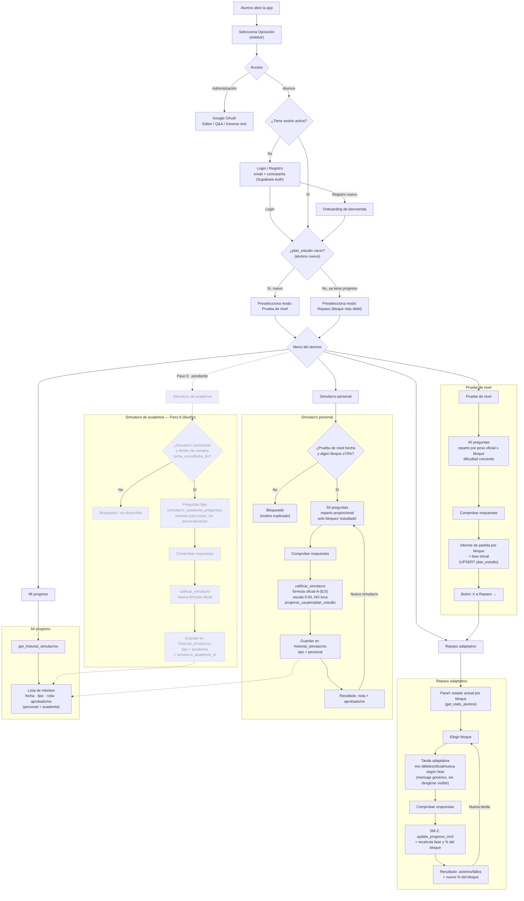

# Flujo completo del alumno

Diagrama de recorrido del alumno desde que entra en la app hasta cada uno de los
4 modos ya implementados (Pasos 1-8) más el **Simulacro de academia** diseñado
para el Paso 9 (pendiente de construir — nodos con borde discontinuo).

Fuente: `app/streamlit_app.py` (`_flujo_alumno` y funciones `_modo_*`),
`app/retrieval.py`, `TODO.md` (decisiones de diseño del hito "App de estudio
del alumno").

## Notas de diseño relevantes al flujo

- **Sin acceso anónimo**: hasta elegir "Administración" o "Alumno" en el
  sidebar no se muestra contenido.
- **Simulacro personal vs. repaso**: el simulacro es una prueba aislada — su
  resultado nunca actualiza `progreso_usuario` (SM-2) ni `plan_estudio`, solo
  queda registrado en `historial_simulacros` (decisión explícita del usuario,
  Paso 8).
- **Regla de producto (Paso 7)**: el alumno nunca ve el desglose
  débiles/oficial/nueva ni la fase (inicio/aprendizaje/consolidación/pre-examen)
  de una tanda — ese dato es para el futuro análisis B2B de la academia, no
  para el alumno.
- **Simulacro de academia (Paso 9, sin construir)**: mismas preguntas para
  todos los alumnos de una ventana temporal, sin personalización; la academia
  nunca genera preguntas, solo autoriza el lote ya generado
  (`normas.simulacros_academia.estado`: generado → autorizado). Diseñado para
  escribir en la misma tabla `historial_simulacros` que el simulacro personal
  (columna `simulacro_academia_id`), de forma que "Mi progreso" ya sabe listar
  ambos tipos sin cambios futuros.
</content>
